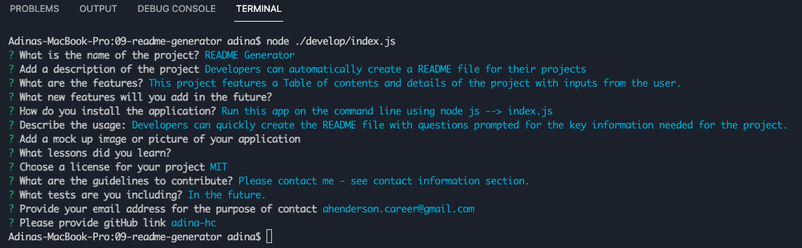
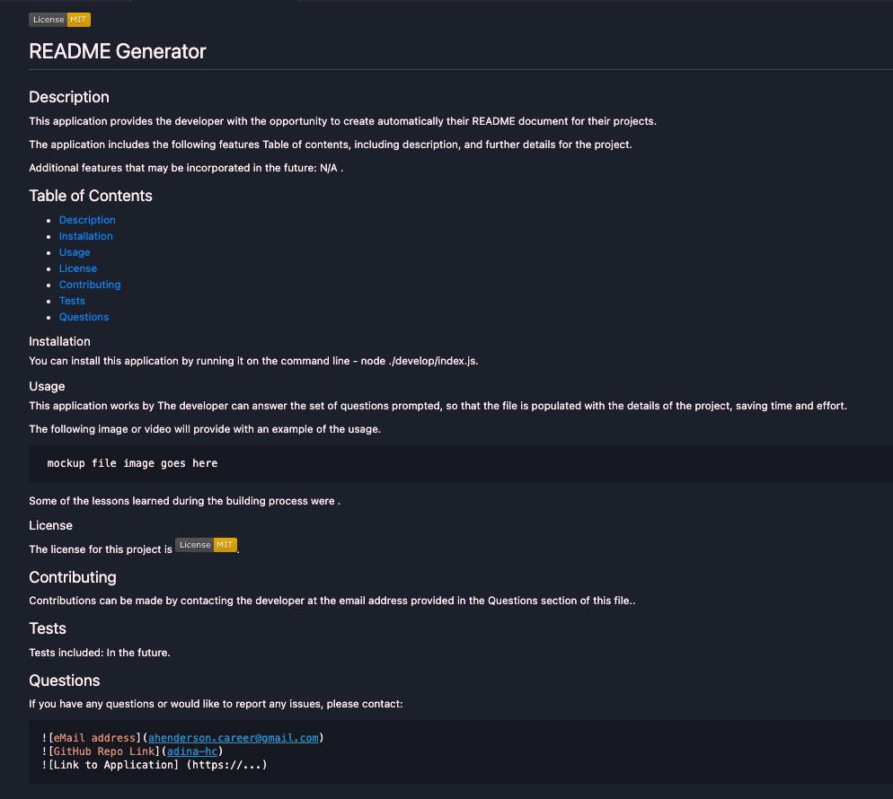

# 09 - Professional README Generator

## Description

Developers need to have a high-quality README file for their projects on GitHub.
This file includes information related to the app, what it is for, how to use, hot to install, how to report issues, and how to make contributions.
The user can quickly and easily create a README file by using a command-line application to generate one. This allows the project creator to devote more time to working on the project.

This application utilizes Node js, featuring inquirer and fs.
The app is invoked by using the following command:

```bash
node ./develop/index.js
```

## Characteristics

```md
A developer can generate a README file to create a professional README document for a new project:
On the running of the index.js file on the command line as described above, the user is presented with:
* Set of questions to add details about the project, including:
    - Project Title
    - Description
    - Table of Contents
    - Installation
    - Usage
    - License
    - Contributing
    - Tests
    - Questions

Once prompted with questions, the app will populate the README skeleton including the user input.

When the user selects a type of license, this license will be populated in the respective section and will show the badge at the top of the file.

When the user clicks on the table of contents, it will route to the specific section of the document according to the user's selection or click.
```

## Application Demo

The demo video can be found in the shared link provided.

Mockup images are included:

### Command Line


### Mock up README image



## Link to GitHub

[Link to GitHub Repo](https://github.com/adina-hc/09-readme-generator)

## Repo and Demo Video

[Link to demo video](https://drive.google.com/drive/folders/1D-9cPHVyrW9H6Qq0YSBa5KEURu6uFl4U?usp=sharing)

